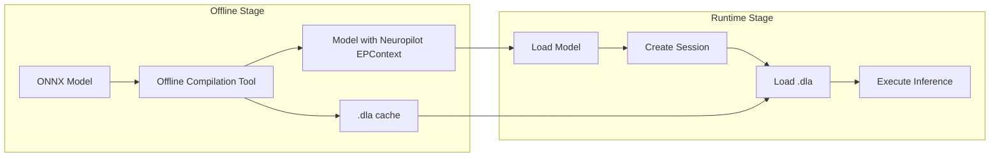

# Neuropilot EP Overview

## 1. Introduction

Neuropilot EP is an Execution Provider for ONNX Runtime, specifically designed to execute deep learning inference on the NPU of MTK (MediaTek) chips. It interacts with the underlying hardware through MTK's Neuron Runtime V2 API, enabling high-performance, low-power model inference.

### 1.1 Core Features

| Feature                     | Description                                         |
| --------------------------- | --------------------------------------------------- |
| **Hardware Acceleration**   | Utilizes MTK NPU for hardware-accelerated inference |
| **Multi-language Bindings** | Supports Python, Java, C++ APIs                     |

### 1.2 Workflow Overview



***

## 2. Environment Setup

### 2.1 System Requirements

| Platform                    | Requirements                                                 |
| --------------------------- | ------------------------------------------------------------ |
| **Android**                 | Android 12.0+ (API 31+), MTK D9300, D9500 (with NPU support) |
| **Development Environment** | macOS 10.15+, Ubuntu 18.04+, Windows 10+                     |

### 2.2 Dependencies

#### 2.2.1 Required Dependencies

| Dependency         | Version Requirement | Description                                   |
| ------------------ | ------------------- | --------------------------------------------- |
| MTK Neuropilot SDK | Version matched     | Includes Neuron Runtime headers and libraries |
| NDK                | r27+                | Android Native Development Kit                |
| Android SDK        | API 31+             | Android Software Development Kit              |
| Java JDK           | 17+                 | Java Development Kit (for Java bindings)      |

#### 2.2.2 Obtaining MTK Neuropilot SDK

MTK Neuropilot SDK needs to be obtained from official MTK channels and includes the following contents:

```
neuron_sdk/
├── usdk/
│   ├── include/
│   │   └── neuron/
│   │      └── api/
│   │          └── RuntimeV2.h
│   └── lib/
│       └── libneuronusdk_runtime.mtk.so
└── mt6993/
    └── bin/
        └── ncc-tflite
```

***

## 3. Build Guide

```bash
# For more build details, see https://onnxruntime.ai/docs/build/android.html

./build.sh \
    # your build arguments \
    --use_neuropilot \
    --neuropilot_sdk_root $NEUROPILOT_SDK_ROOT

```

The build artifacts do not depend on specific MTK library files; file paths need to be provided at runtime.

## 4. Usage Guide

### 4.1 Model Preparation

Neuropilot EP uses EPContext mode, which requires compiling ONNX models to a format executable by MTK NPU.

#### 4.1.1 Using the Conversion Script tools/python/convert_onnx_to_neuropilot_ep.py

Before using, you need to install the `mtk_converter` package bundled with the Neuropilot SDK
into the current Python environment.

Look for the package archive under the SDK, for example:

```text
<sdk_root>/offline_tool/mtk_converter_*_packages.zip
```

##### Command Line Arguments

| Parameter | Required | Description |
| --------- | -------- | ----------- |
| `--model` | Yes | Input ONNX model path |
| `--soc` | Yes | Target SoC list. Supports `mt6991` and `mt6993`. You can use `--soc mt6991 mt6993` or `--soc mt6991,mt6993` |
| `--sdk` | Yes | Neuropilot SDK directory path (`neuron_sdk`) |
| `--output` | No | Output directory, default `./output` |
| `--ep-opset-version` | No | Opset version used for the generated EPContext ONNX, default `13` |
| `--ep-ir-version` | No | IR version used for the generated EPContext ONNX, default `7` |

##### Usage Example

```bash
# Basic usage
python tools/python/convert_onnx_to_neuropilot_ep.py \
    --model /path/to/model.onnx \
    --soc mt6991 \
    --sdk /path/to/neuron_sdk \
    --output ./output
```

```bash
# Convert for multiple SoCs
python tools/python/convert_onnx_to_neuropilot_ep.py \
    --model /path/to/model.onnx \
    --soc mt6991,mt6993 \
    --sdk /path/to/neuron_sdk \
    --ep-opset-version 13 \
    --ep-ir-version 7 \
    --output ./output
```

##### Output Directory Structure

```
output/
├── intermediate/
│   ├── onnx/
│   │   ├── model.onnx              # Original model copy
│   │   └── model_nhwc.onnx         # NHWC rewritten model when 4D IO is found
│   ├── output_check/
│   │   ├── {input_name}.npy        # Output check test input
│   │   └── {output_name}.npy       # Output check test output
│   └── tflite/
│       └── {soc}/
│           └── model.tflite        # Per-SoC TFLite intermediate format
└── converted/
    └── {soc}/
        ├── model.dla               # Compiled DLA file
        └── model_epcontext.onnx    # Final EPContext model for ORT
```

##### Notes

- **Platform Limitation**: Linux only, Neuropilot SDK tools (`mtk_onnx_converter`, `ncc-tflite`) are only available on Linux
- **Dependency Requirements**: Requires `onnx`, `onnxruntime`, `numpy`, and the SDK-provided `mtk_converter` package
- **SDK Path**: The `--sdk` parameter must point to the Neuropilot SDK directory containing `host/bin/ncc-tflite`
- **Target SoCs**: The script accepts either space-separated values such as `--soc mt6991 mt6993` or comma-separated values such as `--soc mt6991,mt6993`
- **NHWC Rewrite**: The script rewrites 4D model inputs/outputs from NCHW to NHWC automatically when needed
- **Output Check**: The script runs an ORT output check between the original and rewritten ONNX models before conversion
- **Final Artifacts**: For each target SoC, the final runtime artifacts are `converted/{soc}/{model_name}.dla` and `converted/{soc}/{model_name}_epcontext.onnx`

### 4.2 Java API Usage (Android)

#### 4.2.1 Basic Usage

Before loading Neuropilot on Android, add the following optional shared library declarations to your
`AndroidManifest.xml`:

```xml
<application ...>
    <uses-library
        android:name="libapuwareutils_v2.mtk.so"
        android:required="false" />
    <uses-library
        android:name="libapuwareapusys_v2.mtk.so"
        android:required="false" />
</application>
```

```kotlin

package com.example.neuropilotdemo

import ai.onnxruntime.OnnxTensor
import ai.onnxruntime.OrtEnvironment
import ai.onnxruntime.OrtLoggingLevel
import ai.onnxruntime.OrtSession

fun runOrtModel(modelPath: String, runtimePath: String = "libneuronusdk_runtime.mtk.so") {
    val env = OrtEnvironment.getEnvironment(OrtLoggingLevel.ORT_LOGGING_LEVEL_INFO, "Test")
    val session = env.createSession(modelPath, OrtSession.SessionOptions().apply {
        this.addNeuropilot(mapOf(
            "runtime_path" to runtimePath
        ))
    })
    val outputs = session.run(mapOf(
        // your inputs
    ))
}

```

### 4.3 Python API Usage

#### 4.3.1 Basic Usage

```python
import onnxruntime as ort

model = ort.InferenceSession(model_file, providers=[("NeuropilotExecutionProvider", {
    "runtime_path": "your_path/neuropilot_runtime.so"
})])

```

#### 4.3.2 Using Dynamic Configuration

```python
import onnxruntime as ort
import numpy as np

run_options = ort.RunOptions()

# Set performance preference (PERFORMANCE, POWER, BOOST)
run_options.add_run_config_entry("preference", "PERFORMANCE")

# Set power policy (DEFAULT, SUSTAINABLE, PERFORMANCE, POWER_SAVING)
run_options.add_run_config_entry("powerPolicy", "SUSTAINABLE")

# Set task priority (LOW, MEDIUM, HIGH)
run_options.add_run_config_entry("priority", "HIGH")

# Prepare input
input_name = model.get_inputs()[0].name
input_shape = model.get_inputs()[0].shape
input_data = np.random.randn(*input_shape).astype(np.float32)

# Execute inference with configuration
outputs = model.run(None, {input_name: input_data}, run_options=run_options)

```

### 4.4 Configuration Options

Neuropilot EP supports the following dynamic configuration options:

| Option        | Type  | Available Values                                        | Description                    |
| ------------- | ----- | ------------------------------------------------------- | ------------------------------ |
| `preference`  | Enum  | `PERFORMANCE`, `POWER`, `BOOST`                         | Performance preference setting |
| `priority`    | Enum  | `LOW`, `MEDIUM`, `HIGH`                                 | Task priority                  |
| `boostValue`  | Range | `0` - `100`                                             | Boost value (MIN=0, MAX=100)   |
| `powerPolicy` | Enum  | `DEFAULT`, `SUSTAINABLE`, `PERFORMANCE`, `POWER_SAVING` | Power policy                   |
